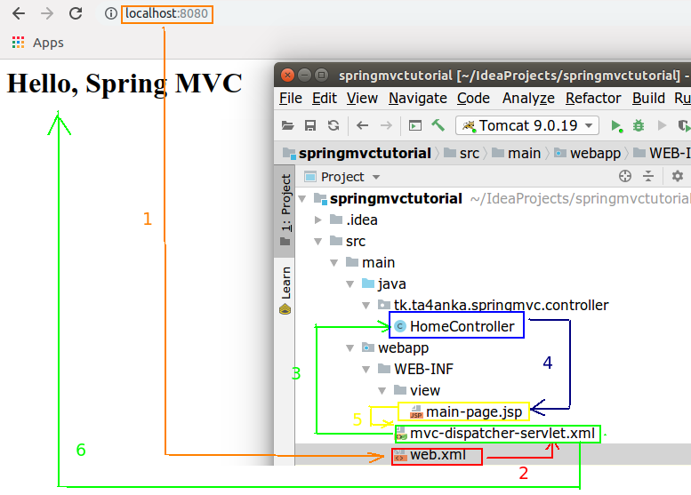

[branch_1](https://github.com/ta4anka/springMVCTutorial/tree/branch_1):

in **web.xml:**

  1.  Configure Spring DispatcherServlet
  2.  Set up URL mappings to Spring MVC Dispatcher Servlet
  
 in **mvc-dispatcher-servlet.xml:**
 
  1. Add support for Spring component scanning
  2.  Add support for conversion, formatting and validation
  3. Configure Spring MVC View Resolver
  
  Create simple HomeController and view
  
  
  **Spring MVC Architecture** [link to original](https://www.java4coding.com/contents/spring/08springMVCArchitecture.html)
  
  
